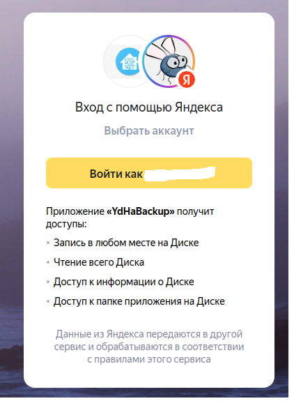
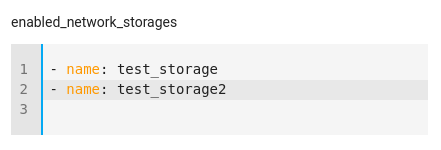

# Копирование резервных копий Home Assistant на ЯндексДиск

Аддон для копирования резервных копий из локального каталога HomeAssistant в произвольно выбранный каталог ЯндексДиска.

В своей работе аддон использует библиотеку [yadisk](https://github.com/ivknv/yadisk)

Количество файлов в каталоге ЯндексДиска настраивается.

Для работы аддона необходимо создать приложение Яндекс в своём Яндекс аккаунте и дать ему права на доступ к ЯндексДиску.


## Установка


**Способ 1.** 

> Настройки > Дополнения > Магазин дополнений > 3 точки (правый верхний угол) > Добавить репозиторий > URL: `https://github.com/maxifly/YaBackupAddon` > Добавить > Yandex Backup > Установить > подождать

## Настройка

### Создание Яндекс приложения

**Внимание!** В Яндексе время от времени меняются способы регистрации приложения.
И иногда эти пути не совсем интуитивно понятны.
В данной документации указан способ, которы работал на момент **22.09.2023**

1. Необходимо зайти в свой аккацнт на Яндексе и перейти по прямой ссылке https://oauth.yandex.ru/client/new
2. Тип приложения выбирается "Веб-сервисы"
3. В поле "Redirect URL" проставляем путь "для разработки": https://oauth.yandex.ru/verification_code
4. В разделе "Доступ к данным" указываем доступы (ищем их, используя строку поиска. Можно ввести просто "Диск"):
   
   Чтение всего Диска

   Запись в любом месте на Диске

   Доступ к информации о Диске
5. Указываем почту для связи
6. Можно добавить иконку приложения
7. Жмём "Сохранить"
8. После сохранения изменений будет создано приложение. Необходимо запомнить ClientId и ClientSecret. (Доступ к этому приложению будет всегда возможен на странице [со списком ваших приложений](https://oauth.yandex.ru/))

### Настройки на стороне Home Assistant
1. Перейти на вкладку "Дополнения/YandexBackup/Конфигурация"
2. Указать путь до каталога на стороне Яндекс Диска (Обязательно укажите "слеш" в начале пути) и максимальное количество файлов в каталоге.
3. Заполнить ClientId и ClientSecret.
4. Указать периодичность запуска процесса копирования файлов на ЯндексДиск. Периодичность задаётся в нотации утилиты cron. 
Например  
\* \* \* \* \* - каждую минуту  
\*/10 \* \* \* \* - каждые десять минут  
1 2 \* \* \* - в 02:01 ночи ежедневно
 
5. Запустить приложение
6. Перейти в веб-интерфейс
7. Выбрать пункт меню "Get new token" 
8. Перейдя по ссылке, указанной в описании формы, подтвердить разрешение на доступ к Яндекс Диску и получить код подтверждения. Вернуться к настройкам и ввести код в соответствующее поле

> 

## Состояние
После первого входа в WEB-интерфейс (или первой загрузки файлов) аддон создаёт сущность **sensor.yandex_backup_state**

Идентификатор сущности можно задать свой, используя необязательный параметр конфигурации **entity_id**
## Особенности копирования файлов
Файлы будут копироваться в на ЯндексДиск в указанное время автоматически, но можно выполнить и ручное копирование файлов, 
выбрав пункт меню  "Upload"
## Работа с сетевыми хранилищами
Аддон выводит информацию обо всех архивах, находящихся как в локальном, так и в сетевом хранилище, но при дефолтных
установках копирует на ЯндексДиск только файлы из локального хранилища. 
Для того, чтобы разрешить копирование из сетевого хранилища необходимо 
в конфигурации разрешить копирование из сетевого хранилища (параметр **upload_from_network_storage**). 
Если при этом параметр **enabled_network_storages** пуст, то копирование будет производится изо всех сетевых хранилищ.
В **enabled_network_storages** можно внести имена разрешённых к копированию хранилищ в формате:
```
 - name: storagename1
 - name: storagename2
```
Кроме того, аддон позволяет загрузить файл с ЯндексДиска в HA. Но только в локальное хранилище.
> 


## Особенности сохранения файлов на Яндекс Диске
Замечено, что при использовании Yandex Rest Api при копировании файлов с расширением копирование происходит значительно с меньшей скоростью, чем без использования расширений (к примеру 10 минут против 10 секунд). 
С чем это связано - доподлинно не известно. В связи с этой особенностью компонент переносит файлы на Яндекс Диск без расширения.
## Удаление и загрузка файлов
Из моодального окна доступны операции удаления файла из ЯндексДиска и из HA. 
При удалении файла из HA он одновременно удаляется из локального хранилища и из сетевых хранилищ.
При загрузке файла в HA из ЯндексДиска файл загружается только в локальное хранилище.
